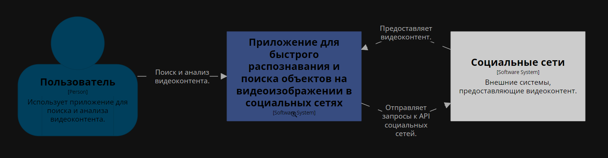
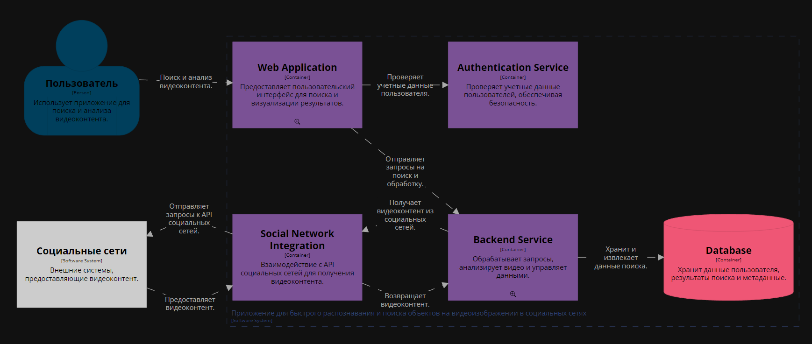
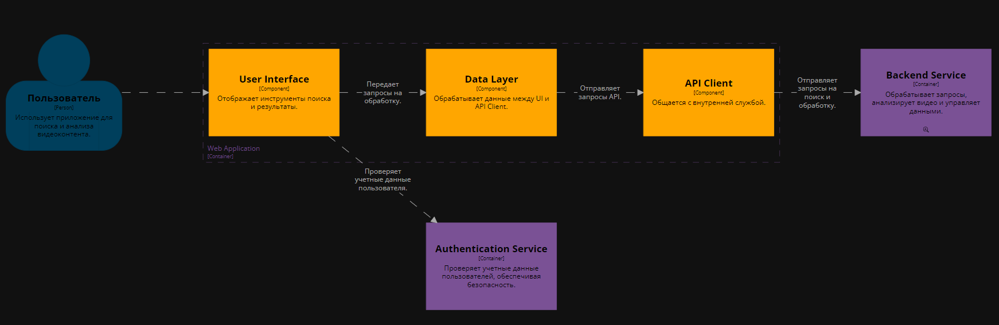
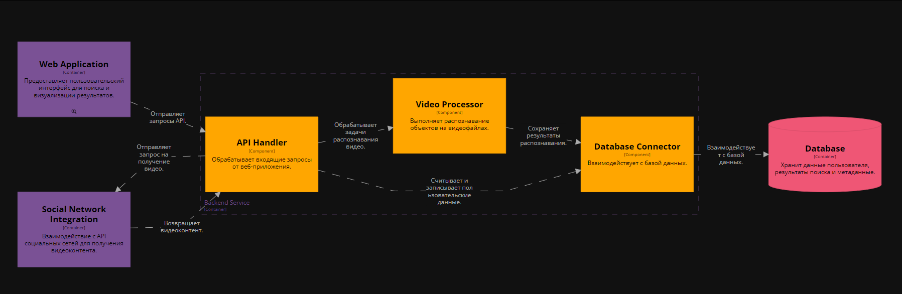

## Диаграмма системного контекста

Диаграмма системного контекста отображает основные взаимодействия между пользователем, системой, и внешними социальными сетями.

**Основные элементы:**
- Пользователь взаимодействует с системой через веб-приложение для поиска и анализа видеоконтента.
- Система управляет процессами поиска и анализа, а также интеграцией с социальными сетями.
- Социальные сети выступают как внешняя система, предоставляющая видеоданные через API.

## Диаграмма контейнеров

Диаграмма контейнеров демонстрирует внутреннюю структуру системы, разделённую на несколько контейнеров:

- Web Application - обеспечивает пользовательский интерфейс для взаимодействия с системой.
- Backend Service - управляет обработкой запросов, анализом видео и взаимодействием с социальными сетями.
- Social Network Integration - интеграция с API социальных сетей для получения данных.
- Database - хранение пользовательских данных, метаданных и результатов анализа.
- Authentication Service - обеспечивает безопасность и проверку учётных данных пользователей.

**Причины выбора архитектуры**:
Cервисно-ориентированная архитектура с разделением на контейнеры обеспечивает:

_Почему это SOA?_

- Сервисный подход - система состоит из отдельных контейнеров, каждый из которых отвечает за определённые функции:
    * Web Application предоставляет интерфейс для пользователя.
    * Backend Service обрабатывает запросы и выполняет сложные задачи, такие как обработка видео.
    * Authentication Service отвечает за проверку безопасности.
    *  Social Network Integration управляет взаимодействием с внешними API.

- Логическая разделённость - контейнеры взаимодействуют через четко определённые интерфейсы (API), что является основным принципом SOA. Например:
    * Web Application общается с Backend Service через API Client.
    * Backend Service взаимодействует с Social Network Integration для получения данных.

- Модульность - система организована таким образом, что каждый сервис можно развивать, тестировать и развертывать независимо.

## Диаграммы компонентов

### Компоненты Web Application
**Описание**:
- User Interface (UI) - отвечает за отображение интерфейса поиска и результатов анализа.
- Data Layer - обеспечивает обработку данных между UI и API Client.
- API Client - упрощает взаимодействие между Web Application и Backend Service.

### Компоненты Backend Service
**Описание**:
- API Handler - обрабатывает запросы от API Client и распределяет их между компонентами.
- Video Processor - выполняет распознавание объектов на видео.
- Database Connector - управляет доступом к базе данных для хранения и получения данных.

