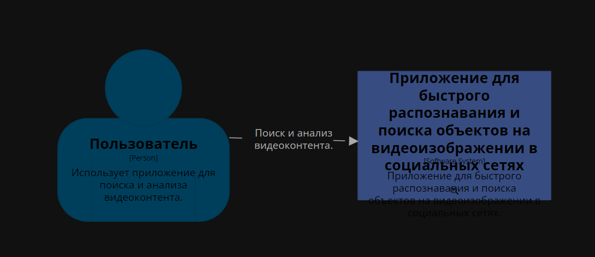
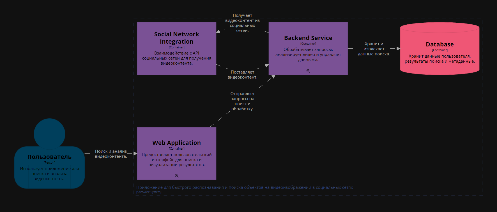
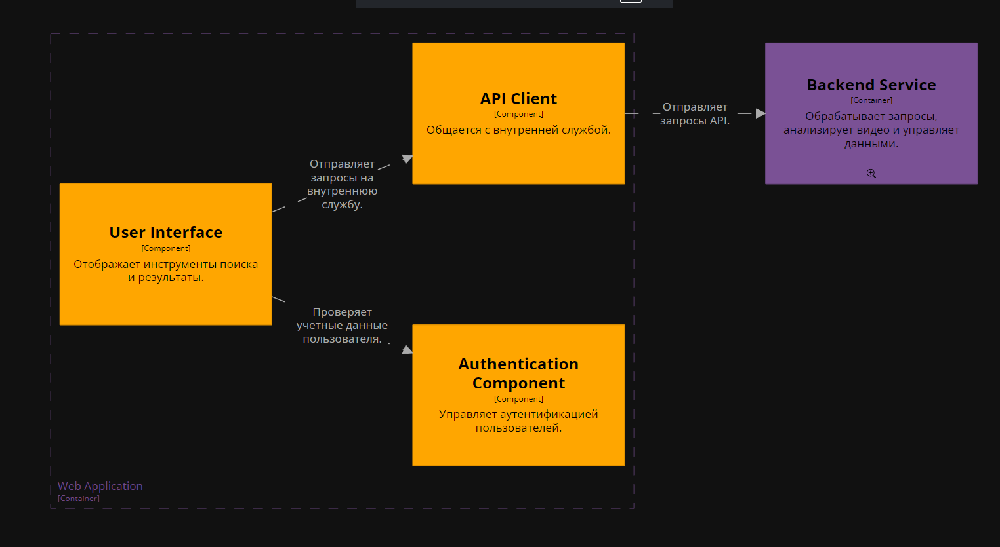
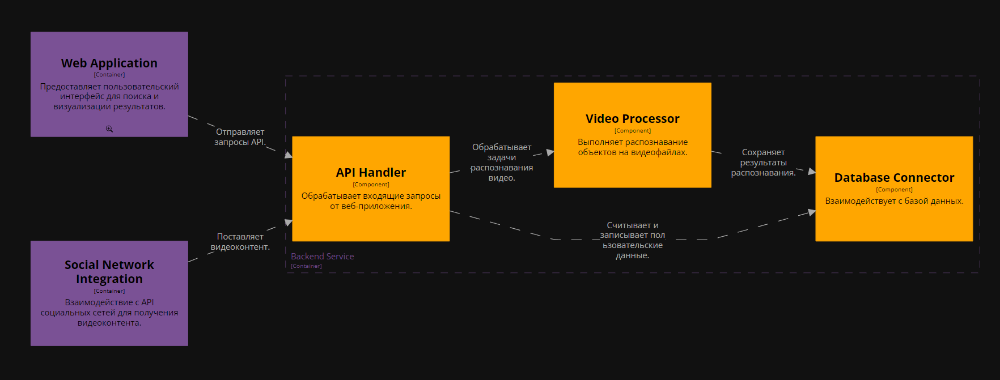

## Диаграмма системного контекста

Диаграмма системного контекста отображает основные взаимодействия между пользователем и системой "Приложение для быстрого распознавания и поиска объектов на видеоизображении в социальных сетях".

**Основные элементы диаграммы**:

- Пользователь (User) - использует приложение для поиска и анализа видеоконтента.
- Приложение для быстрого распознавания и поиска объектов (System) - представляет собой единое решение, которое предоставляет интерфейс для поиска объектов, анализа видео       и     взаимодействия с социальными сетями.
- Взаимодействие - пользователь взаимодействует с приложением через веб-интерфейс, инициируя поиск и анализ видеоконтента. Приложение, в свою очередь, выполняет интеграцию с социальными сетями, анализирует данные, и предоставляет результаты пользователю.

## Диаграмма контейнеров

Диаграмма контейнеров описывает архитектуру приложения на уровне контейнеров, показывая, как система разделена на модули, взаимодействующие друг с другом.

**Основные элементы**:

- Web Application (Веб-приложение):
    Обеспечивает доступ пользователя к функционалу системы через браузер. Состоит из следующих компонентов:
        1. User Interface - отображает результаты и предоставляет инструменты для поиска.
        2. Authentication Component - обеспечивает проверку учетных данных пользователя.
        3. API Client - отправляет запросы к внутренним службам.

- Backend Service (Серверная служба):
    Ядро системы, обрабатывающее запросы, выполняющее анализ видео и управляющее данными. Основные компоненты:
        1. API Handler - обрабатывает входящие запросы.
        2. Video Processor - выполняет распознавание объектов в видео.
        3. Database Connector - управляет запросами к базе данных.

- Social Network Integration (Интеграция с социальными сетями):
    Управляет взаимодействием с API социальных сетей. Основные компоненты:
        1. API Fetcher - извлекает видеоконтент.
        2. API Parser - форматирует ответы от социальных сетей.

- Database (База данных):
    Хранит результаты анализа, метаданные и пользовательскую информацию.

**Причины выбора архитектуры**:
Микросервисная архитектура с разделением на контейнеры обеспечивает:
- Масштабируемость - возможность масштабировать отдельные модули, такие как обработка видео или интеграция с социальными сетями.
- Надежность - локализация ошибок внутри контейнеров, минимизируя влияние на другие компоненты.
- Гибкость - упрощение добавления новых функций через интеграцию дополнительных сервисов.

## Диаграммы компонентов

### Компоненты Web Application
**Описание**:
- User Interface (UI):
    Отвечает за отображение инструментов поиска, результатов анализа, и взаимодействие с пользователем.
- Authentication Component:
    Проверяет учетные данные пользователей, обеспечивая безопасность.
- API Client:
    Упрощает отправку запросов к API серверной службы.
- Взаимодействие: 
    Пользователь взаимодействует с UI, который обращается к API Client. Для входа в систему используется Authentication Component.

### Компоненты Backend Service
**Описание**:
- API Handler:
    Принимает запросы от API Client и направляет их в нужные компоненты сервера.
- Video Processor:
    Выполняет основные задачи анализа видео: распознавание объектов и формирование результатов.
- Database Connector:
    Обеспечивает доступ к данным, необходимым для работы сервиса, включая сохранение и извлечение результатов.

