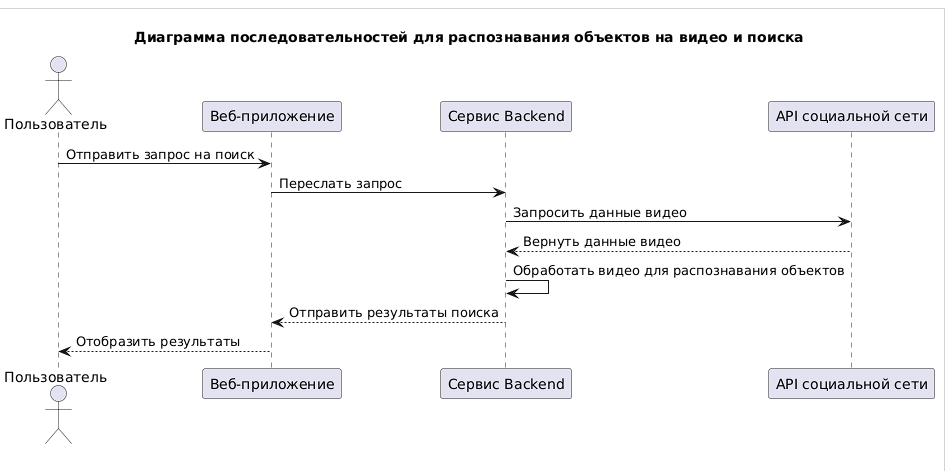
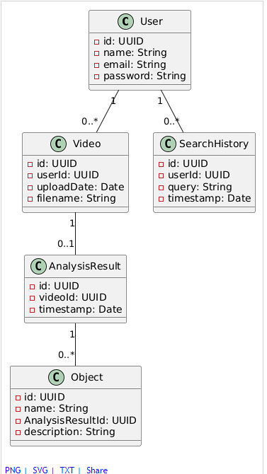

## Диаграммы компонентов

Во второй лабораторной


## Диаграмма последовательностей



Диаграмма демонстрирует процесс распознавания объектов в загруженном видео.

## Модель БД



Диаграмма классов UML описывает основные сущности:

- User- хранит информацию о пользователе.
- Video - содержит метаданные о загруженном видео.
- AnalysisResult - хранит результаты анализа.
- Object - хранит информацию об объектах.
- SearchHistory - логирует запросы пользователя.

## Принципы разработки

Применение основных принципов разработки

- ***KISS (Keep It Simple, Stupid)***
    
    Код организован в небольшие и понятные классы с четкими методами. Каждый класс решает только одну задачу, что упрощает чтение и сопровождение.

    * Принцип - код должен быть простым и понятным, без излишней сложности.

    * Как применено:
       
        Классы разбиты на небольшие модули с чёткими задачами:
            
            - VideoProcessor отвечает только за извлечение объектов из видео.
            - ResultsFormatter форматирует результаты, а не обрабатывает видео или генерирует отчёты.
            - ReportGenerator генерирует отчёт на основе готовых результатов.
    
    * Преимущества:

        - Код легко читать и сопровождать.
        - Каждый класс делает ровно то, что от него ожидается.

    * Пример кода
        ```
        class VideoProcessor:
            def extract_objects(self, video_path):
                print(f"Обработка видео: {video_path}")
                return ["машина", "дерево", "человек"]

        ```

- ***YAGNI (You Aren't Gonna Need It)***
    
    Код не содержит ненужного функционала. Например, вместо сложных алгоритмов для распознавания объектов используется симуляция результатов.

    * Принцип - реализовать только тот функционал, который действительно нужен.

    * Как применено:
       
        - Вместо сложных алгоритмов распознавания используется симуляция (return ["машина", "дерево", "человек"]).
        - Нет избыточного кода для обработки всех возможных случаев — добавление сложных функций, таких как фильтры, выполняется только по мере необходимости

    * Преимущества:

        - Экономия времени разработки.
        - Упрощение кода на ранних этапах.

    * Пример кода
        ```
        class VideoProcessor:
            def extract_objects(self, video_path):
                # Здесь не используется сложный алгоритм, а возвращается упрощённый результат
                return ["машина", "дерево", "человек"]
        ```

- ***DRY (Don't Repeat Yourself)***
    
    Код избегает дублирования логики, например, повторная обработка объектов использует уже существующие методы.

    * Принцип - реализовать только тот функционал, который действительно нужен.

    * Как применено:
       
        - Логика форматирования результатов вынесена в отдельный класс ResultsFormatter. Это позволяет переиспользовать её в разных частях программы.
        - process_video обрабатывает весь процесс — от распознавания до генерации отчёта, минимизируя повторение кода.

    * Преимущества:

        - Легче менять или улучшать функциональность: достаточно изменить один метод.
        - Код становится более модульным и тестируемым.

    * Пример кода
        ```
        def process_video(video_path, processor, formatter, reporter):
            objects = processor.extract_objects(video_path)
            formatted_results = formatter.format_results(objects)
            reporter.generate_report(formatted_results)

        ```

- ***SOLID***:
    * S: Single Responsibility Principle (Принцип единственной ответственности)
        
        Каждый класс или модуль должен отвечать только за одну задачу.
        
        Класс VideoProcessor отвечает только за обработку видео, а ResultsFormatter — за форматирование результатов.
        Это делает код легче тестируемым и изменяемым: изменения в форматировании не затрагивают логику обработки видео.

    * O: Open/Closed Principle (Принцип открытости/закрытости)
        
        Классы должны быть открыты для расширения, но закрыты для модификации.
        
        Класс AdvancedVideoProcessor расширяет VideoProcessor, добавляя новую функциональность, не изменяя базовый класс.
        Это позволяет добавлять новые функции (например, распознавание новых типов объектов), не трогая основной код, что снижает риск внесения ошибок.

    * L: Liskov Substitution Principle (Принцип подстановки Барбары Лисков)
        
        Объекты подкласса должны быть взаимозаменяемыми с объектами базового класса.
        
        AdvancedVideoProcessor может использоваться везде, где ожидается VideoProcessor. Подкласс сохраняет интерфейс и поведение базового класса, лишь добавляя новое.

        Почему это важно: код, работающий с базовыми классами, не должен зависеть от конкретной реализации, что повышает его универсальность и гибкость.


    * I: Interface Segregation Principle (Принцип разделения интерфейса)
        
        Клиенты не должны зависеть от методов, которые они не используют.

        Классы в примере имеют четко определенные обязанности и интерфейсы. Например, ReportGenerator работает только с форматированными результатами и не содержит методов, связанных с обработкой видео или форматированием.

        Почему это важно: это предотвращает создание «универсальных» классов с большим количеством методов, из которых используется лишь часть.

    * D: Dependency Inversion Principle (Принцип инверсии зависимостей)
        
        Модули высокого уровня не должны зависеть от модулей низкого уровня. Оба должны зависеть от абстракций.

        Функция process_video принимает в качестве аргументов абстракции (processor, formatter, reporter). Это позволяет легко заменять их на другие реализации, не меняя логику функции.

        Почему это важно: это упрощает тестирование и позволяет легко заменять компоненты, такие как процессоры видео или генераторы отчетов.


- ***BDUF (Big Design Up Front)***

    * Принцип - полное проектирование системы выполняется до начала её реализации.

    * Применимость - в данном проекте BDUF не подходит, так как система разрабатывается поэтапно, начиная с базовых функций. Такой подход позволяет гибко реагировать на     изменения требований.
    
    * Пример отказа:
        
        В коде начальная версия VideoProcessor возвращает упрощённый результат (["машина", "дерево", "человек"]). Это позволяет сосредоточиться на базовой функциональности без излишнего проектирования алгоритмов распознавания.

- ***SoC (Separation of Concerns)***
    
    * Принцип - каждый компонент отвечает за свою задачу, что упрощает разработку, тестирование и поддержку.

    * Применимость - полностью реализовано. Код разделён на классы с чёткими обязанностями:

            - VideoProcessor обрабатывает видео,
            - ResultsFormatter форматирует результаты,
            - ReportGenerator генерирует отчёт.
    
    * Пример из кода:
        ```
        class VideoProcessor:
            def extract_objects(self, video_path):
                return ["машина", "дерево", "человек"]

        class ResultsFormatter:
            def format_results(self, objects):
                return f"Распознанные объекты: {', '.join(objects)}"
        ```

    * Обоснование - такой подход минимизирует взаимозависимости между частями системы, улучшая масштабируемость и тестируемость.

- ***MVP (Minimum Viable Product)***

    * Принцип - создаётся минимально жизнеспособная версия продукта для проверки ключевых функций.

    * Применимость - используется. Базовая версия кода фокусируется на основных функциях: распознавание объектов, форматирование и отображение результатов.

    * Пример из кода:
        ```
        objects = processor.extract_objects(video_path)
        formatted_results = formatter.format_results(objects)
        reporter.generate_report(formatted_results)
        ```
        Это минимально достаточный цикл обработки видео для проверки основной функциональности.

    * Обоснование - MVP позволяет быстро получить обратную связь, минимизируя затраты на разработку.

- **PoC (Proof of Concept)**
    
    - Принцип - доказательство концепции для проверки жизнеспособности идеи или технологии.

    - Применимость - используется на этапе проверки базовых функций, например, симуляция распознавания объектов вместо сложных алгоритмов.

    - Пример из кода:
        ```
        return ["машина", "дерево", "человек"]
        ```
        Этот метод демонстрирует концепцию без реализации сложной логики.

    - Обоснование - PoC позволяет убедиться в жизнеспособности идеи до инвестирования ресурсов в её полную реализацию.