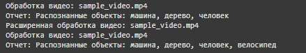

1. Во второй лабе
2. 

Диаграмма демонстрирует процесс распознавания объектов в загруженном видео.

3. 

Диаграмма классов UML описывает основные сущности:

User: Хранит информацию о пользователе.
Video: Содержит метаданные о загруженном видео.
AnalysisResult: Хранит результаты анализа.
Object: Хранит информацию об объектах.
SearchHistory: Логирует запросы пользователя.

4.

Применение основных принципов разработки

KISS:
Реализация модулей минимально сложная: каждый метод выполняет только одну задачу. Например, processVideo() в VideoProcessor только анализирует видео, делегируя другие задачи.

YAGNI:
Код фокусируется только на текущих требованиях, без избыточного функционала. Например, поиск выполняется только по метаданным, пока нет необходимости в анализе запросов.

DRY:
Используются вспомогательные методы для исключения дублирования. Например, взаимодействие с базой данных централизовано в DBConnector.

SOLID:
S (Single Responsibility): Каждый класс отвечает за одну задачу.
O (Open/Closed): Легко добавить новые методы анализа, не изменяя существующий код.
L (Liskov Substitution): Подклассы могут заменять родительские классы (например, разные алгоритмы обработки).
I (Interface Segregation): Разделены интерфейсы обработки и поиска.
D (Dependency Inversion): Используются зависимости через интерфейсы, например, для базы данных.