# Документация по API

## Общий обзор

Создаваемое API предназначено для:

* Управления информацией о пользователях (регистрация, просмотр профиля и т.п.).
* Управления видеоконтентом (загрузка метаданных, просмотр, обновление).
* Запуска анализа видео (распознавание объектов).
* Поиска результатов анализа (по ключевым словам и типам объектов).

Формат обмена данными: JSON
Базовый URL (пример): http://localhost:3000/api/v1

## Проектные решения

### Ресурсно-ориентированный стиль URL

* Каждая сущность (пользователь, видео, результаты анализа) имеет свой «ресурс» в URL.
* Обоснование: Это упрощает понимание API, делает его более читаемым и согласованным с рекомендациями REST.

### Использование HTTP-методов согласно смыслу

* GET: получение данных
* POST: создание ресурса, запуск анализа
* PUT: обновление ресурса
* DELETE: удаление ресурса
* Обоснование: Полное соответствие принципам REST, когда каждый метод несёт чёткую семантику.

### Возврат статус-кодов HTTP

* 200 OK — успешный запрос (GET, PUT, DELETE).
* 201 Created — успешное создание ресурса (POST).
* 400 Bad Request — некорректные данные на входе.
* 404 Not Found — ресурс не найден.
* 500 Internal Server Error — внутренняя ошибка сервера.
* Обоснование: Клиенту удобно понимать состояние запроса без дополнительного парсинга тела ответа.

### Единый формат ответа (JSON)

* Все ответы сервера (включая ошибки) приходят в формате JSON, пример для ошибок:

```
{
  "error": {
    "code": 404,
    "message": "Resource not found"
  }
}
```

* Обоснование: Единообразие облегчает интеграцию с различными клиентами (web, mobile, desktop).

### Использование Path и Query-параметров

* Path-параметры (например, GET /api/v1/users/{id}) используются для идентификации конкретного ресурса.
* Query-параметры (например, GET /api/v1/videos?limit=10&offset=0) используются для фильтрации, пагинации и сортировки.
* Обоснование: Чёткое разделение контекста ресурса (в path) и способа выборки (в query).

### Валидация входных данных

* Проверка корректности формата JSON, обязательных полей (например, имя пользователя).
* При ошибке — возврат 400 Bad Request с описанием проблемы.
* Обоснование: Предотвращает запись некорректных данных в систему и упрощает отладку.

### Использование токенов (базовая схема авторизации)

* (Опционально) Пример: передача Authorization: Bearer <token>
* Обоснование: Обеспечивает безопасность запросов, даёт возможность гибкой проверки прав доступа.

### Поддержка версионирования

* api/v1 в URL позволяет в будущем вводить api/v2 без ломки обратной совместимости.
* Обоснование: В реальных проектах изменения API (добавление полей или изменение структуры) не должны ломать уже работающие клиенты.

## Описание конечных точек

8 конечных точек (минимум 6 используются для базового задания, две дополнительные включают PUT и DELETE для повышенной сложности).

### Пользователи (Users)

* GET /api/v1/users

    * Описание: Получить список всех пользователей.
    * Параметры запроса: могут отсутствовать. (Возможна пагинация через query-параметры ?limit=10&offset=0).
    * Пример ответа (200 OK):
    ```
    [
    {
        "id": 1,
        "username": "john_doe",
        "email": "john@example.com"
    },
    {
        "id": 2,
        "username": "alice",
        "email": "alice@example.com"
    }
    ]
    ```

* GET /api/v1/users/{id}

    * Описание: Получить информацию о конкретном пользователе по его ID.
    * Параметры запроса: id — идентификатор пользователя.
    * Пример ответа (200 OK):
    ```
    {
    "id": 10,
    "username": "video_fan",
    "email": "fan@example.com"
    }
    ```
    * Коды ответов:
        404, если пользователь не найден.

* POST /api/v1/users

    * Описание: Создать нового пользователя.
    * Тело запроса (JSON):
    ```
    {
    "username": "new_user",
    "email": "new_user@example.com",
    "password": "Qwerty123"
    }
    ```
    * Пример ответа (201 Created):
    ```
    {
    "id": 15,
    "username": "new_user",
    "email": "new_user@example.com"
    }
    ```
    * Коды ответов:
        400, если обязательные поля не указаны или формат неверный.

* PUT /api/v1/users/{id} (повышенная сложность)

    * Описание: Обновить данные пользователя (email, пароль и т.д.).
    * Path-параметры: id — идентификатор пользователя.
    * Тело запроса (JSON):
    ```
    {
    "email": "updated_user@example.com",
    "password": "NewPassword123"
    }
    ```
    * Пример ответа (200 OK):
    ```
    {
    "id": 15,
    "username": "new_user",
    "email": "updated_user@example.com"
    }
    ```
    * Коды ответов:
        * 404, если пользователь не найден.
        * 400, если данные некорректны.

* DELETE /api/v1/users/{id} (повышенная сложность)

    * Описание: Удаление пользователя.
    * Path-параметры: id — идентификатор пользователя.
    * Пример ответа (200 OK):
    ```
    {
    "message": "User deleted successfully"
    }
    ```
    * Коды ответов:
        404, если пользователь не найден.

* GET /api/v1/videos

    * Описание: Получить список загруженных видео (метаданные).
    * Пример ответа (200 OK):
    ```
    [
    {
        "id": 101,
        "title": "Beach vacation",
        "description": "Video from summer trip",
        "status": "ready"
    },
    {
        "id": 102,
        "title": "Car test drive",
        "description": "New electric car review",
        "status": "analyzing"
    }
    ]
    ```

* POST /api/v1/videos

    * Описание: Создать новую запись о видео в системе (или запустить анализ).
    * Тело запроса (JSON):
    ```
    {
    "title": "New Year Party",
    "description": "Video from holiday event",
    "fileUrl": "http://example.com/videos/newyear.mp4"
    }
    ```
    * Пример ответа (201 Created):
    ```
    {
    "id": 103,
    "title": "New Year Party",
    "description": "Video from holiday event",
    "status": "analyzing"
    }
    ```
    * Коды ответов:
        400, если отсутствуют обязательные поля.

* GET /api/v1/videos/{id}/analysis

    * Описание: Получить результаты анализа по конкретному видео.
    * Path-параметры: id — идентификатор видео.
    * Пример ответа (200 OK):
    ```
    {
    "videoId": 103,
    "objects": [
        {
        "name": "person",
        "timestamp": "00:00:12"
        },
        {
        "name": "car",
        "timestamp": "00:01:05"
        }
    ],
    "analysisStatus": "completed"
    }
    ```
    * Коды ответов:
        404, если видео не найдено или ещё не анализировалось.

# Тестирование API при помощи Postman

## Тесты - users get

```
pm.test("Response status code is 200", function () {
  pm.response.to.have.status(200);
});


pm.test("Content-Type header is application/json", function () {
    pm.expect(pm.response.headers.get("Content-Type")).to.include("application/json");
});


pm.test("Response time is less than 200ms", function () {
  pm.expect(pm.response.responseTime).to.be.below(200);
});


pm.test("Validate the user object schema - email, id, and username", function () {
    const responseData = pm.response.json();
    
    pm.expect(responseData).to.be.an('array');
    responseData.forEach(function(user) {
        pm.expect(user).to.be.an('object');
        pm.expect(user).to.have.property('email').that.is.a('string');
        pm.expect(user).to.have.property('id').that.is.a('number');
        pm.expect(user).to.have.property('username').that.is.a('string');
    });
});

pm.test("Response has array of users", function () {
    var jsonData = pm.response.json();
    pm.expect(jsonData).to.be.an("array");
});

pm.test("Email is in a valid format", function () {
  const responseData = pm.response.json();
  
  responseData.forEach(function(user) {
    pm.expect(user.email).to.be.a('string').and.to.match(/^[^\s@]+@[^\s@]+\.[^\s@]+$/);
  });
});
```

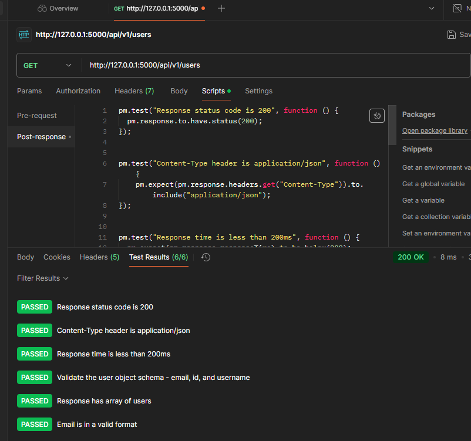

## Тесты users post

```
pm.test("Status code is 201", function () {
    pm.response.to.have.status(201);
});


pm.test("Response has expected fields", function () {
    var jsonData = pm.response.json();
    pm.expect(jsonData).to.have.property("id");
    pm.expect(jsonData).to.have.property("username", "test_user");
    pm.expect(jsonData).to.have.property("email", "test@example.com");
});
```

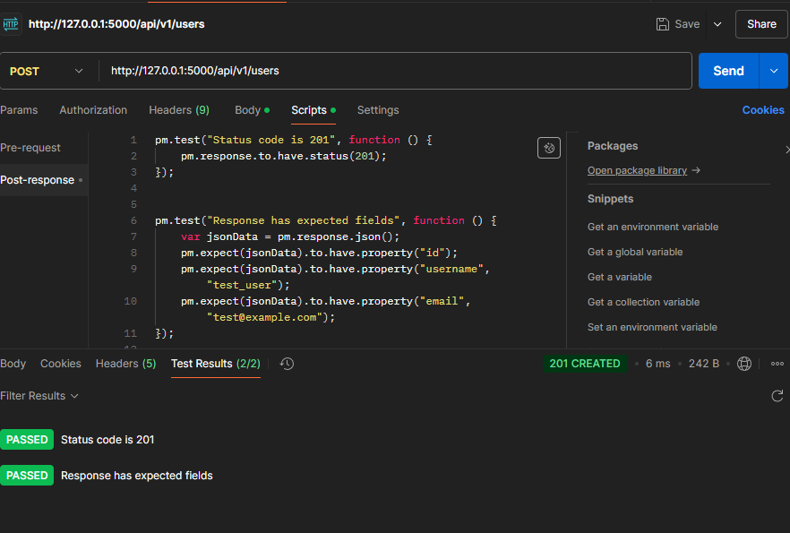

## Тесты users get/{id}

```
pm.test("Status code is 200", function () {
  pm.response.to.have.status(200);
});

pm.test("Response contains user fields", function () {
  let jsonData = pm.response.json();
  pm.expect(jsonData).to.have.property("id");
  pm.expect(jsonData).to.have.property("username");
  pm.expect(jsonData).to.have.property("email");
});

```
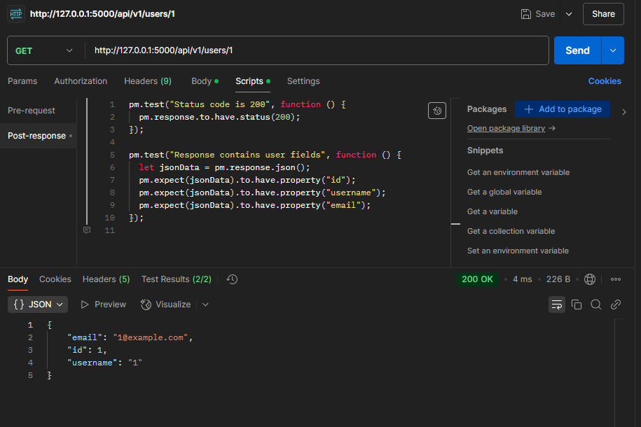


```
pm.test("Status code is 404", function () {
  pm.response.to.have.status(404);
});

pm.test("Response has error message", function () {
  let jsonData = pm.response.json();
  pm.expect(jsonData).to.have.property("error");
  pm.expect(jsonData.error).to.have.property("message");
});

```
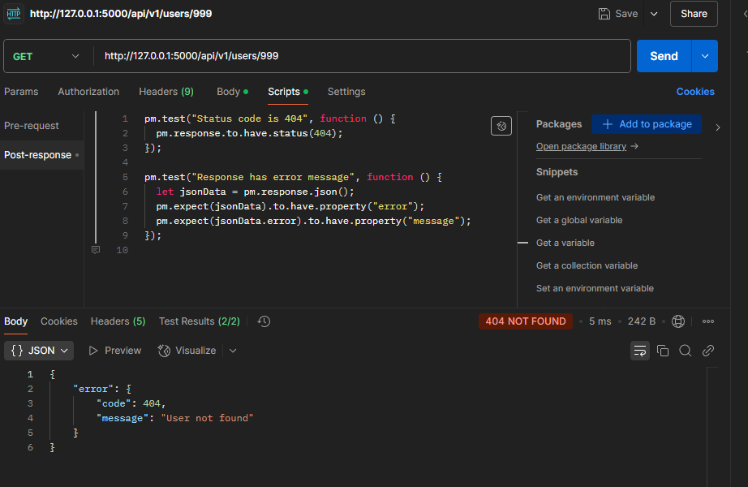

## Тесты users put/{id}

```
pm.test("Status code is 200", function () {
  pm.response.to.have.status(200);
});

pm.test("User updated correctly", function () {
  let jsonData = pm.response.json();
  pm.expect(jsonData).to.have.property("id", 2);
  pm.expect(jsonData).to.have.property("email", "updated_user@example.com");
});

```

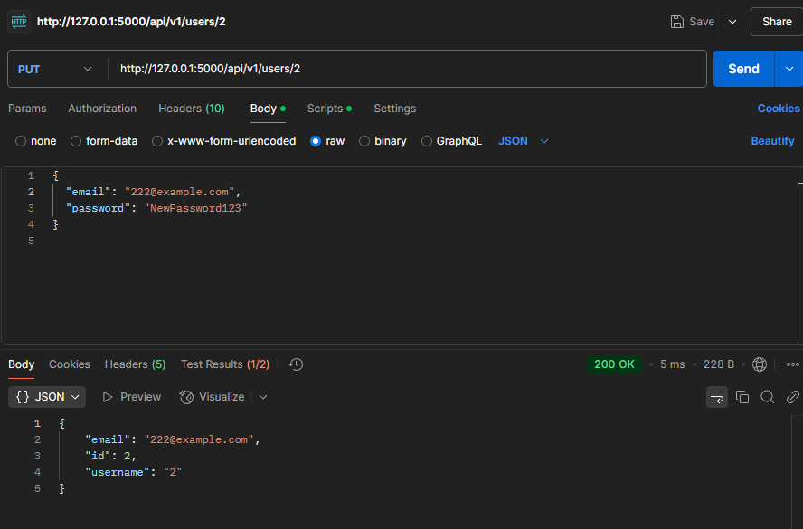

```
pm.test("Status code is 404", function () {
  pm.response.to.have.status(404);
});

pm.test("Error message exists", function () {
  let jsonData = pm.response.json();
  pm.expect(jsonData).to.have.property("error");
});

```
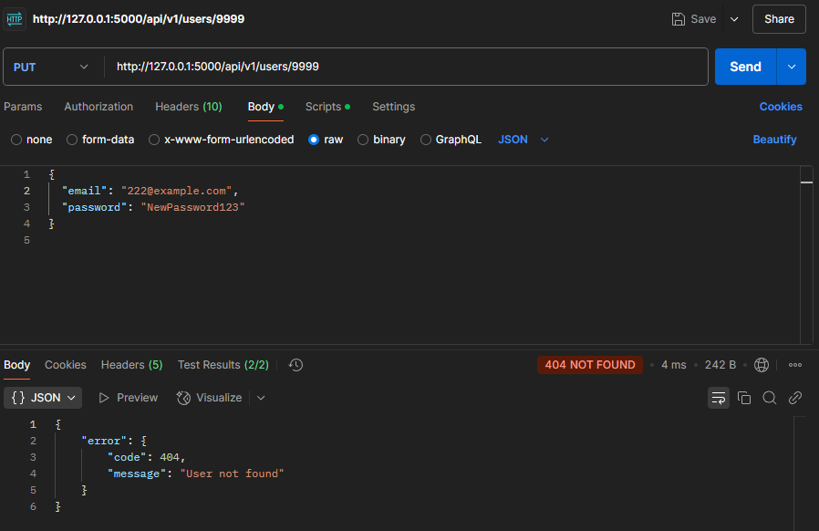


## Тесты delete users id

```
pm.test("Status code is 200", function () {
  pm.response.to.have.status(200);
});

pm.test("User deletion message", function () {
  let jsonData = pm.response.json();
  pm.expect(jsonData).to.have.property("message", "User deleted successfully");
});

```
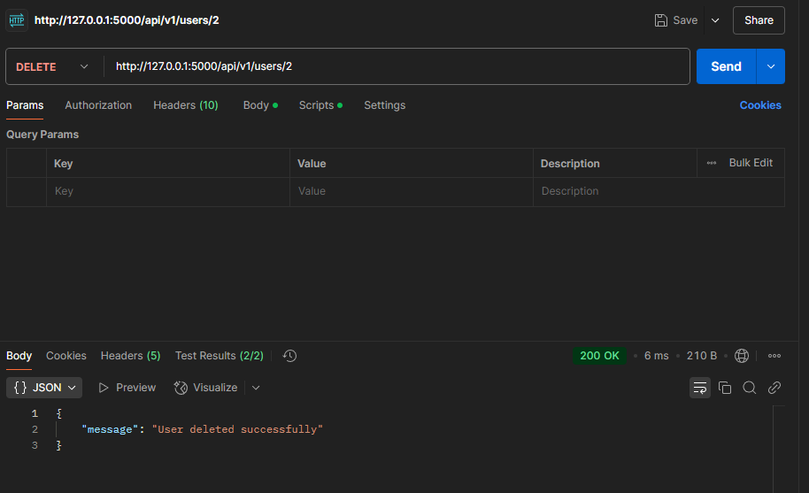


```
pm.test("Status code is 404", function () {
  pm.response.to.have.status(404);
});

pm.test("Error message exists", function () {
  let jsonData = pm.response.json();
  pm.expect(jsonData).to.have.property("error");
});

```
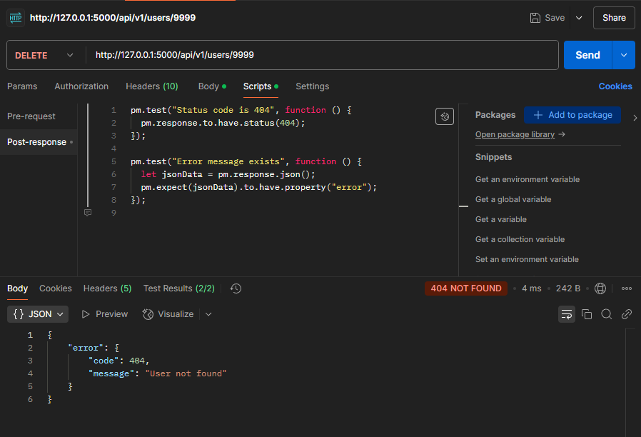


## Тесты get videos

```
pm.test("Status code is 200", function () {
  pm.response.to.have.status(200);
});

pm.test("Response is an array of videos", function () {
  let jsonData = pm.response.json();
  pm.expect(jsonData).to.be.an("array");
});

pm.test("Each video has a title and status", function () {
  let videos = pm.response.json();
  videos.forEach(video => {
    pm.expect(video).to.have.property("title");
    pm.expect(video).to.have.property("status");
  });
});
```
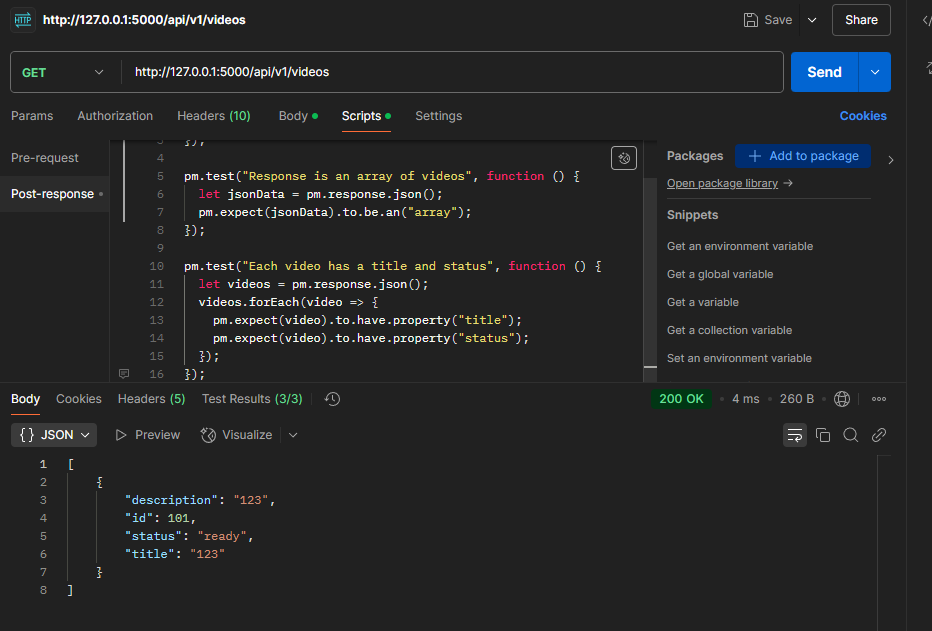

## Тесты post videos 

```
pm.test("Status code is 201", function () {
  pm.response.to.have.status(201);
});

pm.test("Created video has the right fields", function () {
  let jsonData = pm.response.json();
  pm.expect(jsonData).to.have.property("id");
  pm.expect(jsonData).to.have.property("title", "йцкйцафыафыа");
  pm.expect(jsonData).to.have.property("status");
});
```
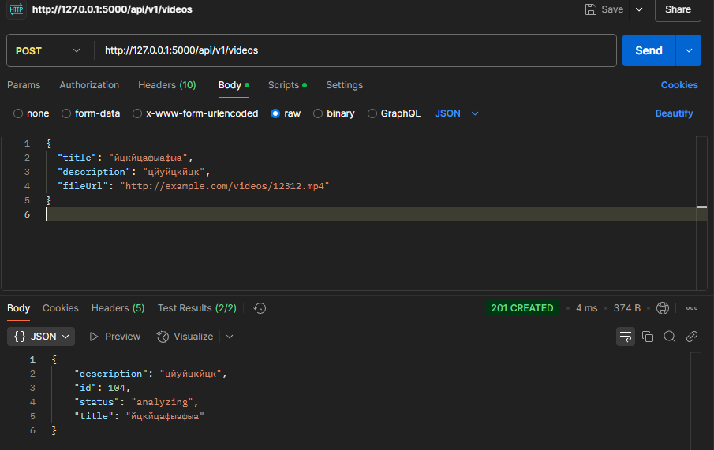


```
pm.test("Status code is 400", function () {
  pm.response.to.have.status(400);
});

pm.test("Error message for missing title", function () {
  let jsonData = pm.response.json();
  pm.expect(jsonData).to.have.property("error");
});
```
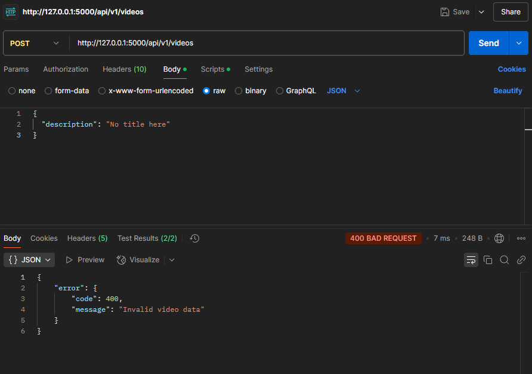

## Тесты analysis video id


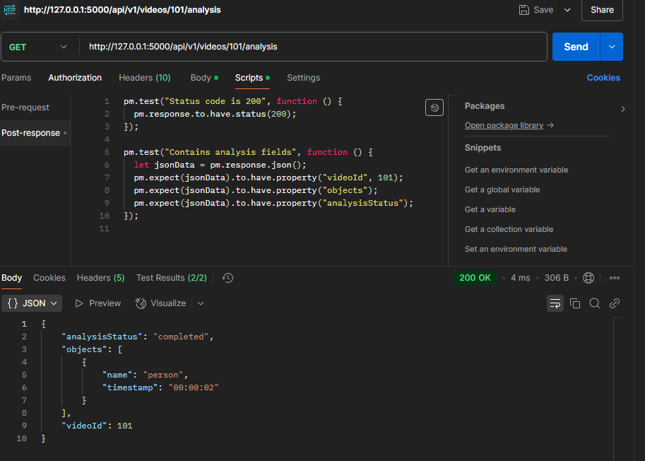
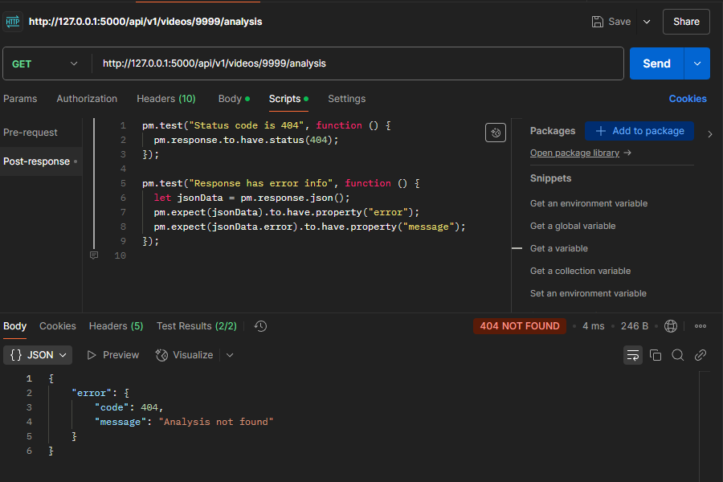
