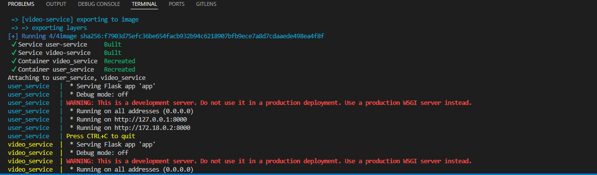
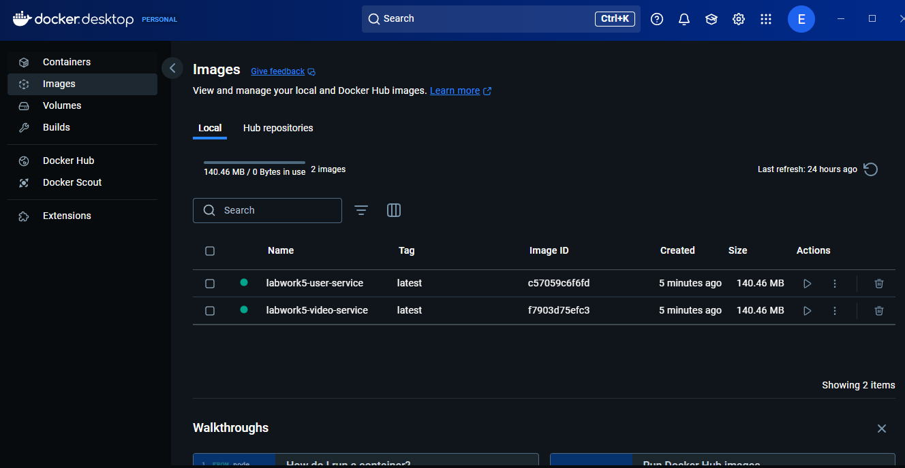
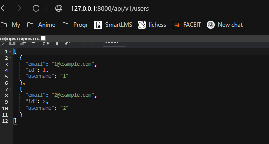
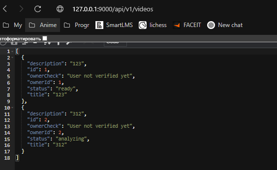

# Общее описание архитектуры

В рамках предыдущих лабораторных у нас было веб-приложение, состоящее из следующих логических модулей:

* Auth Service (для аутентификации и управления пользователями).
* Video Processing Service (для загрузки и анализа видеоконтента).
* Social Network Integration (для интеграции с соцсетями) — опционально.
* Database (хранилище данных) или отдельный сервис для работы с БД (при желании можно выделить отдельно).

Для упрощения мы возьмём два независимых микросервиса:

* User Service (управление пользователями, профилями, аутентификацией).
* Video Service (загрузка видео, запуск анализа, хранение/получение метаданных).

Они взаимодействуют по HTTP. Например:

* User Service хранит информацию о пользователях (логины, пароли, профили).
* Video Service осуществляет операции с видео: создание записи о видео, запуск анализа и т.д. При этом для действий, требующих авторизации, сервис «Video» обращается к     сервису «User».

User Service:
* Предоставляет API для регистрации и авторизации пользователей:
    * POST /users/register
    * POST /users/login
    * GET /users/profile
* Хранит данные о пользователях в своей БД (например, PostgreSQL).

Video Service:
* Предоставляет API для загрузки/обновления информации о видео, запуска анализа:
    * POST /videos (создать запись о видео)
    * GET /videos/:id (получить информацию о видео)
    * GET /videos/:id/analysis (результаты анализа)
* Для проверки авторизации получает токен от клиента и/или запрашивает данные в User Service (по токену).

# Реализация микросервисной архитектуры в Docker

Основные моменты:

* user-service и video-service находятся в одной Docker-сети, что позволяет им взаимодействовать по DNS-именам (user-service, video-service).
* depends_on указывает, что video-service будет запускаться после user-service.
* Порты прокинуты: 8000 (для user-service) и 9000 (для video-service).

Запуск контейнеров и демонстрация работы: docker-compose up --build

